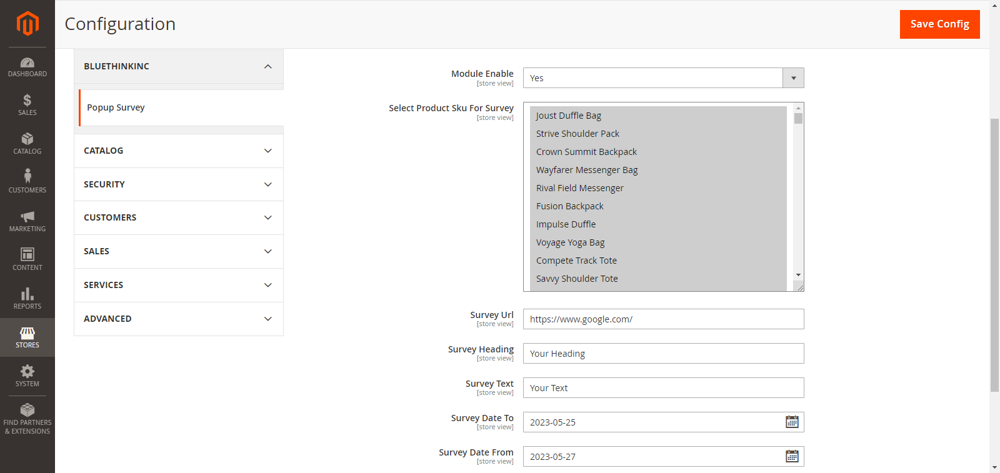
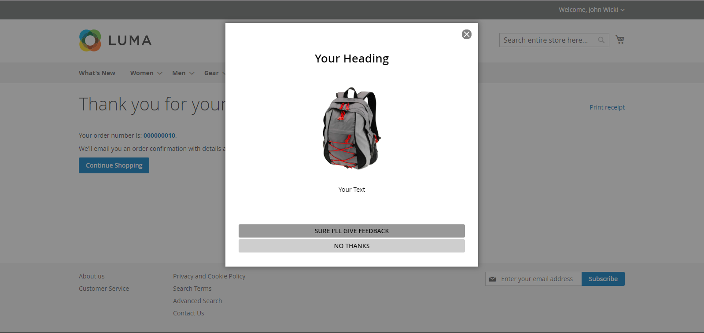

# Pop Survey Modal

- Popup survey modals often include questions about customer preferences, interests, or needs. By providing this information, customers can receive more personalized and relevant offerings in the future. For example, they may receive customized product recommendations or targeted promotions based on their survey responses.

